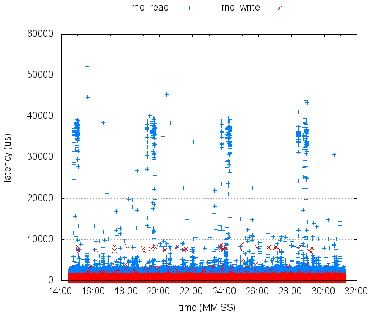

#iobench

##A microbenchmark for storage systems or devices such as hard disk and flash SSD.

Features:

- Various IO sequences including sequential/random reads/writes, and mixed IOs.
- Multi-threading to simulate multiple outstanding IOs.
- Using O_SYNC and O_DIRECT to try to bypass OS or file system buffer. Support raw IO on device file.
- Automatically generate figures for latency, throughput and IOPS.

Check the help to get more information.

##Getting started
Just type 
`make` or `./compile.sh` to build it, then run `./iobench`, it will print messages about read and write latency of your current disk.

It is tested on Linux and Mac OS X.

Note that it is not recommended to use this tool on Mac OS X, because `O_DIRECT` and `lseek64` is not available on OS X. You may end up benchmarking the disk cache. It's only for development and test purpose.

For more details, please see the help page.

```
$ ./iobench -h

NAME
       iobench - microbenchmark for storage devices/systems

SYNOPSIS
       iobench  [ -d time ] [ -f filename ] [ -n count ] [ -H ]
                [ -p size ] [ -o filename ] [ -P ] [ -r percent ]
                [ -R time ] [ -s addr ] [ -S addr ] [ -t count ]
                [ -w percent ]
       iobench  -h

DESCRIPTION
       iobench is a microbenchmark for storage systems or devices
       such as hard disk and flash SSD. It provides the following
       features:
           - Various IO sequences including sequential/random
             reads/writes, and mixed IOs with any R/W ratio.
           - Multi-threading to simulate multiple outstanding IOs.
           - Using O_SYNC and O_DIRECT to try to bypass OS or file
             system buffer. Support raw IO on device file.
       It is recommended to tune your devices/systems for prefetching
       or write-back cache with some tools like hdparm.

OPTIONS
   -d <time>       Duration of test of each thread in seconds. 
                   The longer the better, especially for SSDs.

   -f <filename>   Filename for test. Can be device file like /dev/sda.
                   This is a recommended way to test new drives.
                   Make sure you have correct permissions.
                   WARNING! All data include partition table will be
                   overwritten! Cannot be recovered!

   -n <count>      Send <number> of requests per thread. Program will
                   terminate by -n or -d which happens first.

   -H              Human friendly output.

   -o <filename>   Output file to append. Default output to console.

   -p <size>       Page size in sector (512B) for IO. This number
                   is multiplied by 512. For example, -p 8 uses 4096
                   as page size.

   -P              Output the execution details of each request.

   -r              Use random addresses. Random IO.

   -R <time>       Rampup interval in seconds between threads.

   -s <addr>       Initial file offset. Automatically aligned by 512.
                   Default to 0.

   -S <addr>       End offset. Automatically aligned by 512. Note
                   that lseek64 is not defined on OSX, so the largest
                   offset on Mac may be 2G even you specify larger
                   value.
                   If this value is larger than file length, reads
                   or writes may happen on the hole of the file. Run
                   'man lseek' to see the details. A safe way is to 
                   generate the file in advance using this tool or
                   dd, then set the end offset smaller than the file
                   length.
                   For sequential read/write, file offset will be
                   reset to initial address (-s) when file offset
                   reaches this value.
                   Within the valid address space, set this value the
                   larger the better, which ensures large disk head
                   movement in random access for hard disk, and might
                   trigger more data movements and block erasures
                   inside SSDs (it highly depends on implementation
                   of FTL).
                   Set this value to the capacity of disk when testing
                   with device file.

   -t <count>      Number of threads.

   -w <percent>    Percent of write requests. 0-100. Default 50.

```

There are some scripts to help you plot the figures with gnuplot. Gnuplot script is generated in output directory with data, can be easily customized to different figures.

`./plot_figures.sh` will run `iobench` and plot the basic performance results into figures with throughput or IOPS.


`./plot_details.sh` will run `iobench` and plot response time or IOPS or throughput for each request on a timeline. This helps to understand the performance consistency during long time test.



##Why another micro benchmark tool?
I want to understand the performance of disks by a very simple tool with easy customization. I developed this micro benchmark tool to understand the performance difference between hard disks and flash SSDs, which is very important for my papers and PhD dissertation. This tool also helps me validate benchmark results of other tools. The code here is a cleanup version. I hope it not only helps you understand the performance of storage systems, but also serves as an educational tool to show how to write a simple benchmark.

I benchmarked several SSDs from Mtron, Intel, and OCZ before. You can find the results here: 
[http://www.tkl.iis.u-tokyo.ac.jp/~yongkun/paper/ieice-yongkun-wang-final.pdf]

##Contact
yongkun at gmail.com

##Misc

You can find many good stuff and microbenchmark tools here:
File and Storage System Benchmarking Portal http://fsbench.filesystems.org/
